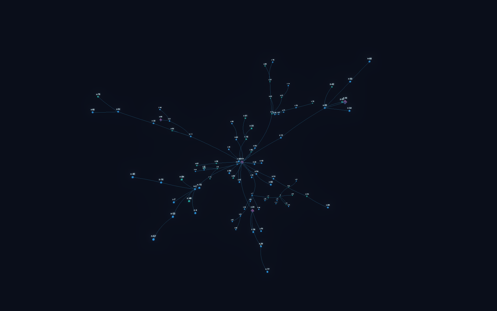
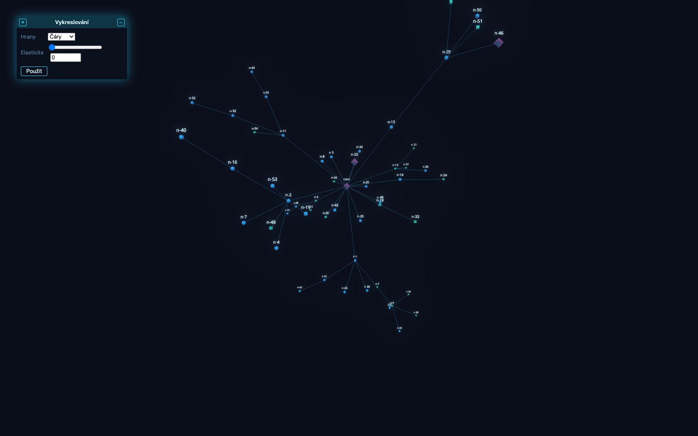
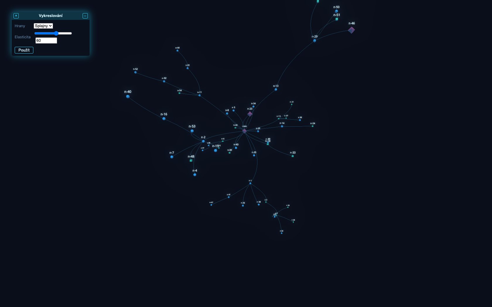
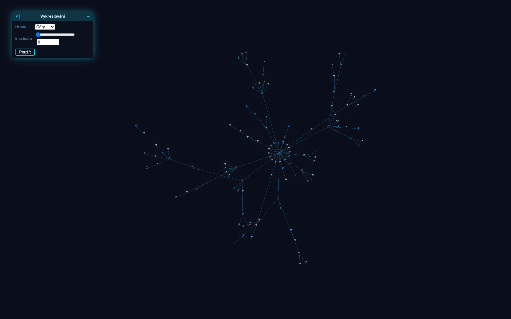

# viewbase

**Živá 2D/3D force-graph vizualizace ovládaná z Pythonu.**

Knihovna, kterou i junior v Pythonu postaví interaktivní vizualizaci vztahů
(graf) v ploše nebo prostoru — bez psaní JavaScriptu, bez npm, bez znalosti
Three.js. Python je zdroj pravdy pro *data, vzhled a chování*; prohlížeč počítá
*rozmístění* (fyzika běží lokálně) a vykresluje. Díky tomu je obraz plynulý a
knihovna zvládá tisíce až desítky tisíc uzlů.



```python
import viewbase as vb

canvas = vb.Canvas(title="Ahoj graf", dimensions=3)
canvas.add_node("a", name="Alfa")
canvas.add_node("b", name="Beta")
canvas.add_edge("a", "b")

vb.serve(canvas, open_browser=True)   # otevře prohlížeč, graf se sám usadí
```

---

## Proč to takhle

Klasická úskalí force-graph vizualizací (škubání, strop pár stovek uzlů) plynou
z toho, že fyzika běží na serveru a klient dostává snapshoty po síti. viewbase to
obrací:

- **Fyzika běží v prohlížeči** ve Web Workeru (d3-force-3d, Barnes-Hut
  *O(n log n)*) — obraz je plynulý na 60 fps, pozice uzlů po síti vůbec
  necestují.
- **Instancovaný rendering** (Three.js `InstancedMesh`) — počet draw callů
  nezávisí na počtu uzlů; popisky jsou SDF text ve WebGL s LOD rozpočtem.
- **Server posílá jen delty** (přidej/změň/odeber uzel·hranu, akce) přes
  WebSocket; graf se může za běhu průběžně přestavovat.

Naměřeno (Apple M4 Pro, headless Chromium): **3 000 uzlů ~120 fps**,
**10 000 uzlů ~86 fps**.

---

## Instalace a spuštění

```bash
git clone <repo> && cd viewBase
python -m venv .venv && source .venv/bin/activate
pip install -e "python[dev]"

# jednorázové sestavení frontendu do python/viewbase/static
(cd frontend && npm install && npm run build)

python examples/quickstart.py     # otevře http://127.0.0.1:8080
```

**Požadavky:** Python ≥ 3.10, Node.js ≥ 20 (jen pro build frontendu).

---

## Ukázky

Spustitelné příklady jsou živá dokumentace — viz tabulka v sekci
[Dokumentace](#dokumentace). Pár výřezů:

### Control okno: vzhled grafu řízený z backendu

Backend definuje **parametrické okno** (typovaná pole int/string/enum); uživatel
hodnoty změní a tlačítkem *Použít* je pošle zpět, backend podle nich řídí graf.
Tady přepíná hrany mezi **čarami** a **splajny** (bezier) a jejich elasticitu —
týž graf, jen přepnutý přepínač:

| Čáry | Splajny |
|---|---|
|  |  |

### 2D ortografický režim

`Canvas(dimensions=2)` přepne na 2D s pan/zoom:



---

## Klíčové koncepty

Vše se točí kolem objektu `Canvas`. Po nastavení grafu zavoláš `vb.serve(canvas)`,
což spustí server a zablokuje; mutace canvasu pak dělej z jiných vláken (Canvas
je thread-safe).

```python
canvas = vb.Canvas(title="Infrastruktura", dimensions=3, theme="cyber",
                   highlight_neighbors=1, quality="auto")

# uzly a hrany (+ libovolná metadata; živé změny kdykoli za běhu)
canvas.add_node("srv-1", type="server", name="Web 01", ip="10.0.0.5")
canvas.add_edge("srv-1", "db-1")
canvas.update_node("srv-1", status="down")     # popisek se přepočte
with canvas.batch():                            # hromadné delty = jedna zpráva
    ...

canvas.node_label("{name} ({ip})")              # šablona popisku z meta klíčů
canvas.define_type("server", shape="box", color="#28d7fe", size=1.4)
```

- **Typy uzlů a témata** — `define_type` (tvary `sphere`/`box`/`octahedron`/
  `tetrahedron`); vestavěná témata `modern`/`cyber` nebo vlastní dict.
- **Eventy** (prohlížeč → Python) — `@canvas.on_click` / `on_hover` /
  `on_background_click` / `on_view_change`; běží v thread-poolu.
- **Akce** (Python → prohlížeč) — `focus`, `highlight`, `show_detail`,
  `set_theme`, `set_edge_style("line"|"spline", elasticity=…)`.
- **Detailní okno** — `detail_window(rows=…)`; klik na uzel otevře tažitelné
  okno s metadaty (styl Amiga Workbench, dok, z-order).
- **Toky** — `define_flow_type` + `flow(src, dst | path=[…], type=…)`: světelné
  částice po hranách (pakety, zprávy, provoz); `count=None` je trvalý tok.
- **Control okna** — `ControlWindow` + `open_window(win, on_submit=…)`:
  backendem řízený parametrický dialog, jehož hodnoty tečou zpět na backend.

Detaily API a chování viz návrhové dokumenty a příklady níže.

---

## Dokumentace

**Spustitelné příklady** (`examples/`) — nejlepší živá reference:

| Soubor | Co ukazuje |
|---|---|
| `examples/quickstart.py` | minimální živý graf (3D) |
| `examples/quickstart2d.py` | 2D ortografický režim |
| `examples/interactive.py` | klik → rozbalení sousedů (eventy/akce) |
| `examples/showcase.py` | téma cyber, typy uzlů, živé barvy, toky, **control okno** (čáry/splajny) |
| `examples/words.py` | mapa slov z Wikipedie (crawl odkazů) |
| `examples/stress.py` | zátěžový test (tisíce uzlů) |
| [`examples/wireshark/`](examples/wireshark/README.md) | **síťové toky**: přehrání pcap, živý odposlech a cesta paketu (traceroute) |

**Návrhové dokumenty** (`docs/superpowers/specs/`) — architektura a rozhodnutí:

- [Návrh knihovny (architektura, protokol, fyzika, rendering)](docs/superpowers/specs/2026-06-10-viewbase-library-design.md)
- [Detailní okno](docs/superpowers/specs/2026-06-14-detail-window-design.md)
- [Traceroute toky (routery jako uzly, multi-hop)](docs/superpowers/specs/2026-06-16-traceroute-toky-design.md)
- [Control okna (parametrické GUI) + křivkové hrany](docs/superpowers/specs/2026-06-17-control-okna-design.md)

Implementační plány (krok za krokem) jsou v
[`docs/superpowers/plans/`](docs/superpowers/plans/).

---

## Architektura

```
Python skript (Canvas API)
        │  data + metadata + vzhled + chování
viewbase (pip balíček: GraphModel, FastAPI + WebSocket, zabalený frontend)
        │  ↓ delty + akce          ↑ eventy (klik, hover, kamera, control okna)
Browser (viewbase.js)
        ├─ GraphStore  – jediné zrcadlo stavu
        ├─ PhysicsWorker – d3-force-3d (Barnes-Hut, 2D/3D)
        └─ Renderer – Three.js instancing, témata, SDF labely, toky, okna
```

### Struktura repozitáře

```
python/viewbase/      pip balíček (canvas, controls, server, protocol, static/)
frontend/             zdrojáky JS (Vite) – build → static/
examples/             spustitelné ukázky = živá dokumentace
docs/superpowers/     návrhové specifikace a plány
docs/images/          screenshoty pro README
legacy/               původní prototyp (referenční)
```

---

## Vývoj

```bash
pip install -e "python[dev]"
cd python && python -m pytest -q          # backend testy
cd frontend && npm install && npm test    # frontend testy (vitest)
cd frontend && npm run build              # sestaví static/ pro balíček
```

Frontend se vyvíjí s Vite/npm, ale výstup buildu se zabalí do Python balíčku —
koncový uživatel npm nepotřebuje.

---

## Stav

Funkční jádro: živý 2D/3D graf, typy uzlů, témata (modern/cyber), SDF popisky,
bloom, quality=auto, eventy/akce, zvýraznění sousedů, detailní okno, toky a typy
toků, wireshark příklady (pcap, živý odposlech, traceroute), **control okna
(parametrické GUI) a křivkové hrany (čáry/splajny + elasticita)**. Plánováno
dále: GLB modely uzlů, distribuce přes wheel + CI, IPv6 v živém odposlechu.
